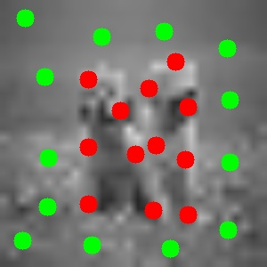

# Image Segmentation using Max-Flow Min-Cut

This project applies graph theory to image segmentation using the **Max-Flow Min-Cut** algorithm. By modeling an image as a flow network and applying the **Edmonds-Karp algorithm**, we segment the image into foreground and background regions.

---

## Background

- The **Max-Flow Min-Cut theorem** is a foundational concept in graph theory.
- In computer vision, images can be treated as graphs, where:
  - Pixels are nodes
  - Edges represent similarity or adjacency
- Solving the segmentation problem becomes finding the minimum cut between the foreground and background.

---

## Approach

- Implemented the **Edmonds-Karp algorithm** (BFS-based Ford-Fulkerson).
- Modeled grayscale images as graphs.
- Applied the algorithm to separate foreground and background based on source/sink labels.

---

## Tools & Libraries

- Python
- NumPy
- OpenCV

---

## How to Run

```bash
python segment.py --input input_image.jpg


## Implementation: Using Max-Flow Min-Cut Theory

For this project, I experimented with an existing image segmentation tool based on the Max-Flow Min-Cut approach, found here:

[https://github.com/julie-jiang/image-segmentation](https://github.com/julie-jiang/image-segmentation)

### How I ran it:

```bash
python imagesegmentation.py yourImage.jpg

A window prompts you to mark **foreground seeds** using the cursor; press `ESC` when done.

Next, a second window opens to mark **background seeds**; press `ESC` to continue.

The program segments the image and shows the output.

Press `ESC` to quit, and the original and segmented images are saved automatically.

---

### Observations:

- The segmentation was generally accurate when clear, well-placed seeds were used.
- Quality depends on the number and accuracy of seeds; more precise seeds yield better segmentation.
- The algorithm sometimes misclassifies areas if seeds are sparse or poorly placed.

---

### Example

| Original Image   | Seeds Marked    | Segmented Result   |
|------------------|-----------------|--------------------|
|  |  |  |


## References

- Boykov & Kolmogorov (2004): "An Experimental Comparison of Min-Cut/Max-Flow Algorithms"
- CIS 5590: Computational Photography

